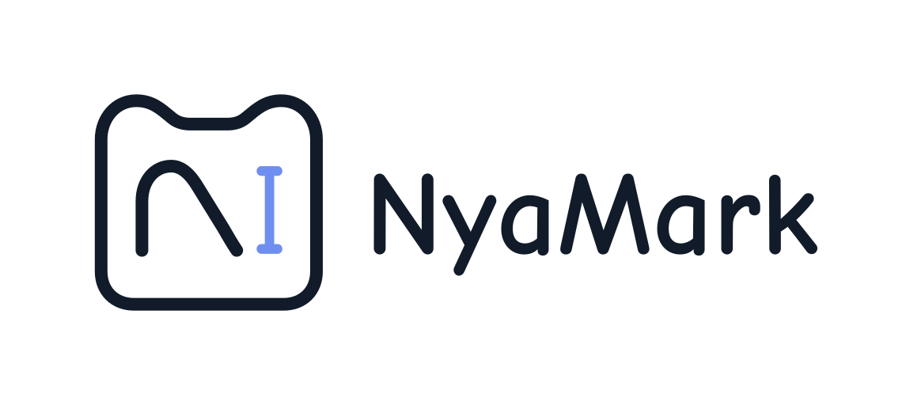

<div align="center">
  <h1 align="center">
    <br>
    NyaMark
  </h1>
  <p align="center">
    A modern Markdown editor based on <a href="https://tauri.app/"><strong>Tauri v2</strong></a> and <a href="https://milkdown.dev/"><strong>Milkdown</strong></a>.
    <br />
    <br />
    <a href="README.md">简体中文</a>
    |
    <a href="README_EN.md">English</a>
  </p>
</div>

<details>
  <summary>Table of Contents</summary>

* [Features](#features)

* [Usage](#usage)

* [Development](#development)

* [Before You Ask](#before-you-ask)

* [License](#license)

* [Acknowledgments](#acknowledgments)

</details>

## Features

* **High-Performance Core**: Leverages Tauri v2 and Rust backend for a blazing-fast, responsive desktop experience.

* **Modern WYSIWYG Experience**: Built on the Milkdown (Crepe) framework, providing a seamless "What You See Is What You Get" editing flow.

* **Rich Extension Support**:

  * **Mathematical Formulas**: Built-in KaTeX support for perfect LaTeX rendering.

  * **Diagram Rendering**: Integrated Mermaid support for flowcharts, sequence diagrams, Gantt charts, and more.

  * **Source Mode**: Powered by CodeMirror 6 at the lower level, offering professional Markdown source editing and syntax highlighting.

* **Cross-Platform**: Native support for Windows, macOS, and Linux.

* **Premium Visuals**: Crafted with TailwindCSS v4 to provide a refined, modern, and intuitive user interface.

## Usage

Go to the [Releases](https://github.com/MliroLirrorsIngenuity/NyaMark/releases) page to download the latest version for your **platform**.

## Development

This project is developed using Bun and Tauri:

```bash
# Install dependencies
bun install

# Start development environment
bun tauri dev

# Build for production
bun tauri build
```

## License

The source code of this project is licensed under the [MIT License](LICENSE).

### License Notes

1. **Retain Copyright Notice**: You must include the original author's copyright and license notice in any copies or derivative software.
2. **Disclaimer**: This project is provided "as is," and the author assumes no legal liability for any issues arising from its use.
3. **Icon Resource Ownership (Important)**:

   * All icon files in the root directory (`.svg`, `.png`, `.icns`, `.icon`, etc.) and all resources in the `src-tauri/icons` directory **are not distributed under the MIT License**.

   * **The aforementioned icon resources are "All Rights Reserved"**. Unauthorized use, modification, or redistribution of these assets in other projects is strictly prohibited.

## Acknowledgments

* [Tauri](https://tauri.app/): An excellent framework for building cross-platform desktop applications.

* [Milkdown](https://milkdown.dev/): A modular WYSIWYG Markdown editor framework.

* [CodeMirror](https://codemirror.net/): The industry-leading code editor component.

* [TailwindCSS](https://tailwindcss.com/): A utility-first CSS framework for efficient UI development.
